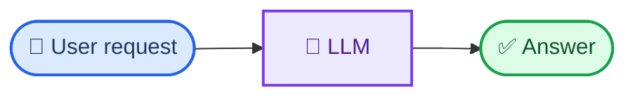
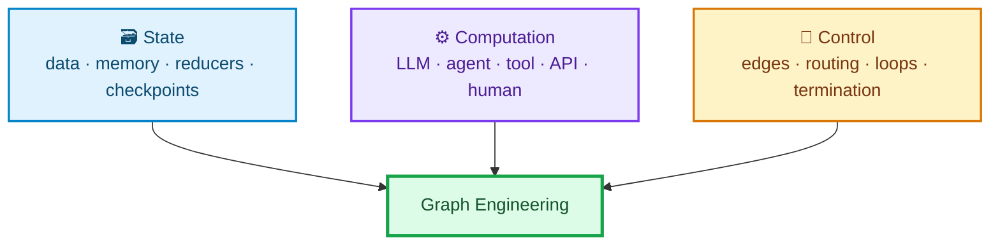
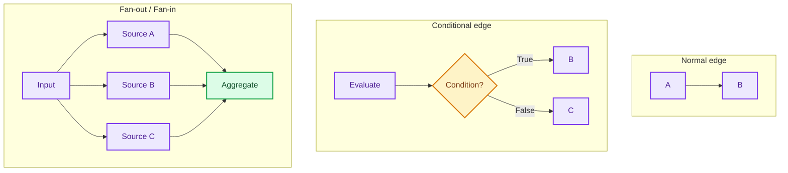
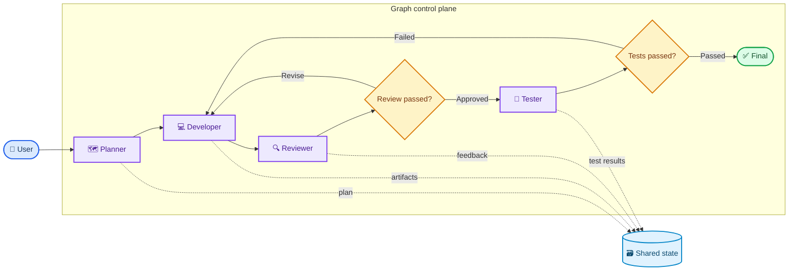
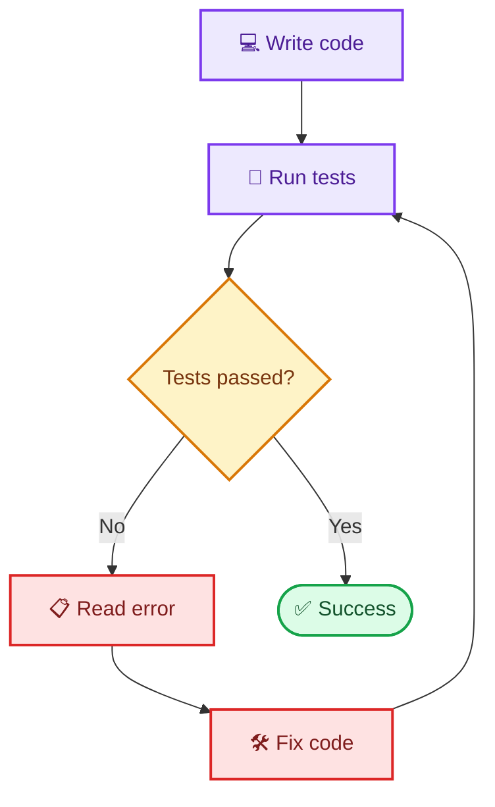
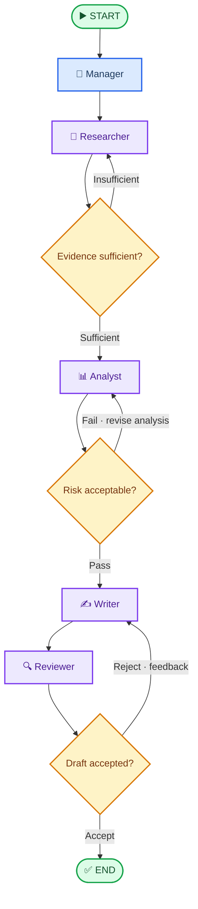
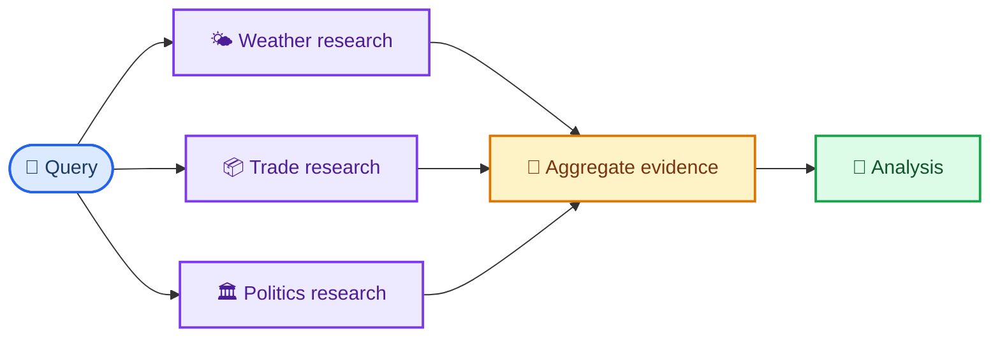
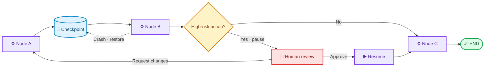
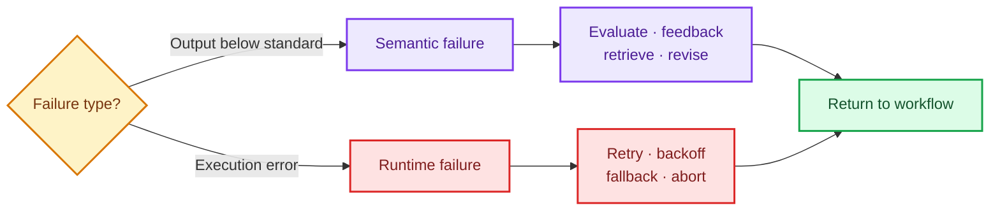
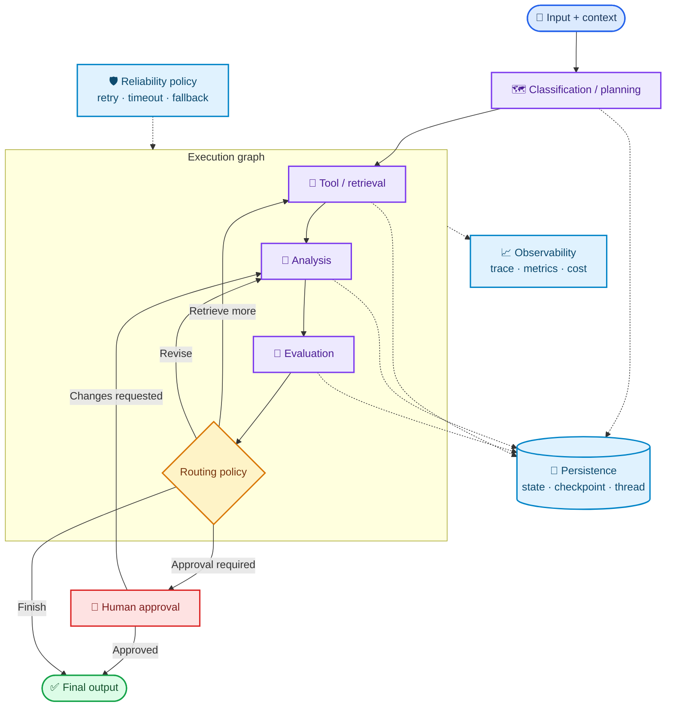

# Graph Engineering

This repository focuses on Graph Engineering for AI agents: designing structured, stateful workflows that can branch, loop, evaluate, recover, and terminate under explicit conditions.

Here, a graph is not a data structure for algorithms such as DFS, BFS, or shortest-path search. It represents the workflow and orchestration of an AI system, where:

- A **node** performs computation.
- **State** stores shared working data.
- An **edge** describes execution flow.
- A **router** selects the next branch.
- A **policy** controls retries, fallbacks, and termination.

> **Graph Engineering is the practice of designing stateful control flow for an AI system.**

## Table of Contents

- [Why Graph Engineering?](#why-graph-engineering)
- [Core Mental Model](#core-mental-model)
- [The Graph as a Control Plane](#the-graph-as-a-control-plane)
- [Loops, Feedback, and Termination](#loops-feedback-and-termination)
- [Graph Engineering and Multi-Agent Systems](#graph-engineering-and-multi-agent-systems)
- [Essential Execution Patterns](#essential-execution-patterns)
- [Reliability and Observability](#reliability-and-observability)
- [Reference Production Architecture](#reference-production-architecture)

## Why Graph Engineering?

A simple LLM system usually follows a single linear path:



This approach works for simple tasks. Once a system must use multiple tools, validate quality, revise failed results, wait for human approval, or continue after an interruption, a linear pipeline is no longer expressive enough.

Graph Engineering models a workflow as a set of steps with explicit responsibilities, allowing the system to:

- maintain state throughout execution;
- select branches based on runtime results;
- run independent nodes in parallel;
- evaluate and improve outputs;
- limit retries and control termination;
- checkpoint, pause, and resume;
- observe the complete execution path.

## Core Mental Model

Graph Engineering can be divided into three major areas:



### State

State is the workflow's shared working memory at a given point in time. It may contain the query, category, evidence, intermediate results, feedback, quality score, retry count, final answer, and execution trace.

Instead of thinking:

> Node A produces output and passes it directly to Node B.

Think:

> Node A reads state and returns a state update; the runtime merges that update; Node B reads the new state.

Here is a minimal state definition for the notebook in this repository:

```python
class GraphState(TypedDict, total=False):
    query: str
    category: str
    evidence: list[str]
    analysis: str
    score: float
    feedback: str
    attempts: int
    final_answer: str
    route_log: Annotated[list[str], operator.add]
```

State should contain the data required for computation and routing, but it should not become a dumping ground for every temporary variable used by individual nodes.

### State Updates and Reducers

Not every field is updated in the same way. A reducer defines how the runtime combines an existing value with a new update.

| Data type | Example | Common strategy |
| --- | --- | --- |
| Current value | `category`, `score`, `feedback` | Overwrite with the new value |
| Accumulated history | `messages`, `route_log` | Append new items |
| Evidence collection | `evidence` | Merge and optionally deduplicate |
| Parallel results | `research_results` | Merge by key or source |

Reducers are especially important when nodes run in parallel or multiple nodes update the same field. Without clearly defined semantics, fan-in can create conflicts or cause data loss.

### Nodes

A node is a unit of computation. It does not have to be an agent, and it does not have to call an LLM.

A node can be:

- an LLM or agent;
- a tool or API call;
- a database query or retriever;
- a deterministic function;
- an evaluator or schema validator;
- a human approval step;
- a subgraph.

> **A node is not synonymous with an agent. Use an LLM only where intelligence is genuinely required.**

### Edges and Execution Patterns

An edge determines which node runs next. The three foundational patterns are normal edges, conditional edges, and fan-out/fan-in.



### Nodes and Routers

Nodes and routers have different responsibilities:

| Component | Input | Responsibility | Output |
| --- | --- | --- | --- |
| Node | State | Perform computation | State update |
| Router | State | Select the next edge | Route or next node |

For example, an evaluator may produce `score = 0.72`; the router reads that score and decides to return to the improvement node because the score is below the threshold.

> **Nodes compute; routers control.**

## The Graph as a Control Plane

A graph is not merely a collection of connected LLMs. It is the control plane that manages state, execution order, and system policy.

| Type of work | Appropriate component |
| --- | --- |
| Semantic understanding, reasoning, critique, text generation | LLM |
| External data retrieval | Tool, API, database, retriever |
| Exact calculations and schema validation | Deterministic code |
| Routing, retry limits, timeouts, termination | Graph and Python policy |
| Approval of high-risk actions | Human |
| Execution persistence and recovery | Checkpointer/runtime |

A development workflow with a graph control plane can be organized as follows:



The mental model to remember is:

> **LLMs provide intelligence. Graphs provide control. Tools provide capabilities. State connects everything.**

## Loops, Feedback, and Termination

### Loop Engineering and Graph Engineering

Loop Engineering focuses on an iteration that improves a result. Graph Engineering covers the entire topology: multiple nodes, branches, shared state, parallelism, quality gates, human approval, persistence, and termination.

A loop is therefore one pattern within Graph Engineering.



### Retry vs. Improvement

`Generate → Fail → Generate again` is only a retry. If the state, information, or strategy does not change, the next attempt may repeat exactly the same failure.

A useful feedback loop follows this pattern:

`Generate → Evaluate → Feedback → Improve → Generate again`

Improvement must introduce a meaningful change, such as:

- adding evidence;
- updating the plan or prompt;
- choosing a different tool or model;
- applying evaluator feedback;
- delegating the task to a more specialized agent.

> **Every iteration should improve the state, information, or strategy.**

### Quality Gates

A quality gate is a control point that determines whether a result is good enough to proceed. A gate may check evidence, test results, risk, confidence, safety, or human approval.

Evaluators and gates should also be kept distinct:

- An evaluator produces assessment data such as a `score`, `feedback`, or validation result.
- A gate or router applies a policy such as `score >= 0.8` to select `finish` or `retry`.

### Termination Policies

Every graph with a loop must answer:

1. When is the workflow considered successful?
2. What is the maximum number of retries?
3. When should the workflow fall back or abort?
4. When should it escalate to a human?
5. When should it accept an imperfect but sufficient result?

| Termination type | Purpose | Example |
| --- | --- | --- |
| Quality termination | Stop when requirements are met | `score >= threshold` |
| Safety termination | Prevent infinite loops or budget overruns | `attempts >= max_retries` |
| Operational termination | Stop because of runtime conditions | deadline, cancellation, unrecoverable error |
| Human termination | Wait for or terminate based on a reviewer's decision | approve, reject, request changes |

> **Feedback loop + termination policy = controlled iteration.**

## Graph Engineering and Multi-Agent Systems

The two concepts address different dimensions:

| Concept | Primary question |
| --- | --- |
| Multi-Agent | How many agents are there, what roles do they have, and how do they communicate? |
| Graph Engineering | What path does the workflow follow, how is state passed, and when does it branch, loop, or terminate? |

Graph Engineering does not require multiple agents. A single coding agent moving through code, test, fix, and termination nodes still forms a graph.

Conversely, multiple agents exchanging messages freely do not necessarily form a clearly orchestrated graph. Multi-Agent design emphasizes specialization and collaboration; Graph Engineering emphasizes orchestration and control.



> **Multi-Agent systems provide specialization; Graph Engineering provides orchestration.**

## Essential Execution Patterns

### Parallelism and Fan-Out/Fan-In

Independent nodes can run in parallel to reduce latency and increase coverage. After fan-out, the graph needs a fan-in point to synchronize and aggregate their results.



Parallelism introduces decisions about reducers, conflict resolution, synchronization, and fan-in policy. Nodes that depend on one another's unfinished outputs should not run in parallel.

### Persistence and Durable Execution

State describes the current data; a checkpoint is a snapshot of state; a thread is a sequence of checkpoints belonging to the same execution or conversation.



Persistence supports long-running workflows, crash recovery, human-in-the-loop interactions, replay, auditing, and debugging. Actions with side effects also require idempotency so that resuming does not send an email, write to a database, or process a payment twice.

### Human-in-the-Loop

Humans are not outside the graph; they are control points within it. A graph can pause before a high-risk action, save a checkpoint, wait for approval, rejection, or edits, and then resume within the correct thread.

Typical use cases include sending important emails, deleting data, processing transactions, changing production systems, or publishing content.

### Subgraphs

As a graph grows, it should be divided into subgraphs by responsibility, such as Research, Analysis, and Review. The parent graph treats each subgraph as a high-level node.

Subgraphs help reuse logic, isolate state, test components independently, and reduce the complexity of the parent graph. Their input/output contracts and the state fields shared between parent and child graphs must be defined explicitly.

## Reliability and Observability

### Semantic Failures and Runtime Failures

A production graph must distinguish poor results from technical failures because the two failure classes require different policies.

| Failure type | Symptoms | Appropriate handling |
| --- | --- | --- |
| Semantic failure | Missing evidence, weak analysis, incorrect intent, low confidence | Evaluate, provide feedback, retrieve more, revise |
| Runtime failure | Timeout, rate limit, API error, invalid response, unavailable database | Retry with backoff, fallback, circuit breaker, graceful failure |



Runtime retries should be bounded, use backoff, and apply only to recoverable errors. Semantic retries must change the context or strategy.

### Deterministic Control and Probabilistic Reasoning

LLMs are probabilistic, while many graph policies need to be deterministic.

| Use an LLM when | Use deterministic logic when |
| --- | --- |
| Semantic or intent understanding is required | A clear threshold exists |
| Reasoning, planning, or critique is required | Schema validation is required |
| Summarization or text generation is required | Exact calculations are required |
| The rules cannot be fully enumerated in code | Permissions, timeouts, or retry limits are involved |

A safe pattern is to let the LLM produce decision data, then have a Python router validate it and apply policy. An LLM should not have unilateral control over unlimited retries, permissions, or high-risk actions.

### Observability

The final answer tells you what the system produced. The execution trace tells you what the system did to produce it.

A production graph should expose:

- the nodes and paths that ran;
- each node's input/output or state update;
- router decisions and their reasons;
- retry counts, failure types, and termination reasons;
- latency, token usage, and cost;
- the models, tools, and external dependencies used;
- checkpoints, threads, and correlation IDs.

Logs should not contain API keys, credentials, personal data, or complete sensitive prompts. Observability must be paired with redaction and access control.

## Reference Production Architecture

A complete graph-based system commonly includes the following layers:



These layers do not necessarily need to be separate nodes. Persistence and observability are usually runtime capabilities that span the entire workflow; routing and termination can live in code-based policies rather than LLM nodes.

## Conclusion

Graph Engineering is not simply the practice of connecting multiple agents or LLMs. It is the design of a stateful control system for AI: the system knows where it is, which step should run next, how to evaluate results, when to revise, how to recover from failure, and when to terminate.

At the foundational level:

> **Graph Engineering = State + Computation + Control.**

At the production level:

> **Graph Engineering = State management + Node design + Control flow + Evaluation + Feedback + Persistence + Reliability + Observability.**
