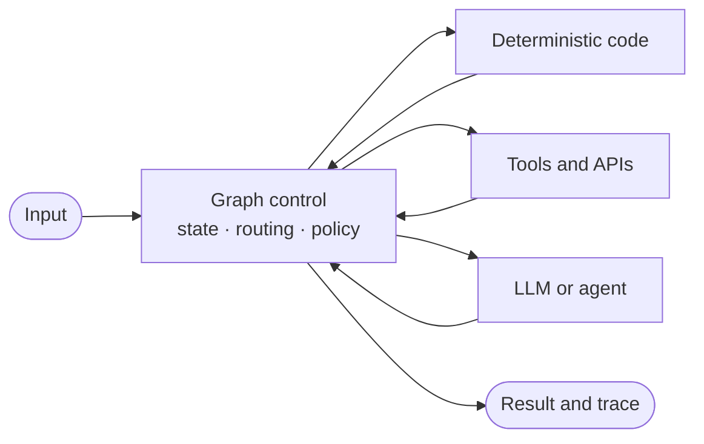

# Graph Engineering

In this repository, Graph Engineering refers to the practice of designing explicit state, computation, control flow, routing, feedback loops, termination policies, recovery mechanisms, and observability for agentic AI systems represented as executable graphs.

> This repository uses **Graph Engineering** as a practical engineering term. It does not claim that the term is an established academic discipline, and it is not another name for LangGraph.

Graph Engineering here means execution control—not graph algorithms, graph storage, or graph-shaped data.

| Concept | Main concern |
| --- | --- |
| Graph algorithms | Traversal and optimization over graph data |
| Knowledge graphs | Representing entities and relationships |
| Graph databases | Storing and querying connected data |
| Agent loop | Repeated reasoning and action |
| Multi-agent systems | Roles, specialization, and communication |
| Graph Engineering | Explicit orchestration and control of AI execution |

## Why Graph Engineering?

A single model call has one path: `input → model → output`. Real agentic systems must also select tools, preserve intermediate work, run independent tasks, evaluate quality, recover from failures, respect budgets, and stop predictably.

An executable graph makes those decisions visible and testable:



The graph is valuable because it owns execution policy even when individual computations are probabilistic.

## Core Mental Model

| Element | Meaning | Typical output |
| --- | --- | --- |
| **State** | Shared working data | Query, evidence, score, attempts, trace |
| **Node** | Computation | An explicit state update |
| **Edge** | Execution transition | The next scheduled node |
| **Router** | Control decision | A named branch |
| **Policy** | Operational rule | Retry, fallback, budget, or termination decision |

Two rules anchor the repository:

> **Nodes compute; routers control.**

> **A node is not synonymous with an agent.**

Use the simplest suitable component:

```text
LLMs   → intelligence
Tools  → capabilities
Graph  → control
State  → shared execution context
```

The concepts are framework-independent. Lessons introduce state, functions, conditions, and control flow first; LangGraph is then used as the primary executable reference.

## Graph vs. Agent Loop vs. Multi-Agent

| Architecture | What it adds | What it does not guarantee |
| --- | --- | --- |
| Plain LLM | One semantic computation | Tools, feedback, or recovery |
| Agent loop | Repeated model/tool interaction | Explicit global control or bounded termination |
| Graph | State transitions, policies, routes, and gates | Multiple agents |
| Multi-agent graph | Specialized actors inside explicit control flow | Good orchestration by itself |

`Agent = computational actor`, `Graph = control structure`, and `Multi-agent = specialization strategy`. A graph can contain zero, one, or many agents. See [Graph, agents, and multi-agent systems](docs/08_multi_agent.md) for the four topologies.

## Five-Minute Example

This deterministic graph classifies an integer and selects one branch. It requires no API key:

```python
from graph_engineering.fundamentals import build_number_graph

graph = build_number_graph()
result = graph.invoke({"value": 6, "trace": []})

assert result["category"] == "even"
assert result["result"] == 12
assert result["trace"] == ["classify:even", "multiply"]
```

The topology is unchanged if `multiply` is replaced by an LLM-backed node. The computation changes; the graph still owns control.

Run it:

```bash
uv sync
uv run python -c "from graph_engineering.fundamentals import build_number_graph; print(build_number_graph().invoke({'value': 6, 'trace': []}))"
```

## Start Here

Follow the sequence in order. Each notebook depends only on concepts introduced earlier.

| Step | Topic | Resource | Outcome |
| ---: | --- | --- | --- |
| 0 | Graph without AI | [Notebook 00](notebooks/00_graph_without_llm.ipynb) | Understand graph mechanics |
| 1 | State and nodes | [Notebook 01](notebooks/01_graph_fundamentals.ipynb) | Understand execution state and reducers |
| 2 | Routing | [Notebook 02](notebooks/02_conditional_routing.ipynb) | Build conditional flows |
| 3 | Feedback | [Notebook 03](notebooks/03_feedback_loops.ipynb) | Build bounded evaluator loops |
| 4 | Parallelism | [Notebook 04](notebooks/04_parallel_execution.ipynb) | Understand fan-out and fan-in |
| 5 | Reliability | [Notebook 05](notebooks/05_reliability_and_termination.ipynb) | Add failure and termination policy |
| 6 | Persistence | [Notebook 06](notebooks/06_checkpointing_and_resume.ipynb) | Pause, checkpoint, resume, and protect side effects |
| 7 | Human-in-the-loop | [Notebook 07](notebooks/07_human_in_the_loop.ipynb) | Apply persistent approval policy |
| 8 | Observability | [Notebook 08](notebooks/08_observability_and_tracing.ipynb) | Trace routes, retries, calls, and termination |
| 9 | Subgraphs | [Notebook 09](notebooks/09_subgraphs.ipynb) | Define isolated computation boundaries |
| 10 | Multi-agent graphs | [Notebook 10](notebooks/10_multi_agent_graph.ipynb) | Use bounded specialist handoffs |
| 11 | Dynamic routing | [Notebook 11](notebooks/11_dynamic_routing.ipynb) | Bound runtime fan-out and allowed tools |
| 12 | Evaluation | [Evaluating graph systems](docs/10_evaluating_graph_systems.md) | Measure control and execution outcomes |
| 13 | Patterns | [Pattern library](patterns/README.md) | Recognize reusable topologies |
| 14 | Project | [Research agent](examples/research_agent/README.md) | See requirements drive graph growth |

For a prose path through the same ideas, start with [What is Graph Engineering?](docs/00_what_is_graph_engineering.md), then continue through the numbered documents.

## Pattern Library

The [pattern library](patterns/README.md) describes reusable topologies rather than framework APIs:

- router;
- evaluator–optimizer;
- retry with feedback;
- fan-out/fan-in;
- human gate;
- subgraph/hierarchical graph;
- dynamic map-reduce;
- escalation;
- guarded supervisor.

Each pattern states its problem, topology, state contract, termination rule, minimal implementation, appropriate uses, and production concerns. The [anti-pattern catalog](docs/anti_patterns.md) covers designs such as God nodes, infinite retry, and LLM-controlled hard policy.

## Example Project

The [research-agent example](examples/research_agent/README.md) evolves one system from a single model call through research, routing, feedback, and parallel evidence gathering. Its point is architectural: graph complexity should grow only when requirements grow. A deterministic fake model keeps every version runnable and testable without network access.

## Production Engineering

Production readiness is more than adding nodes. A graph should define:

- bounded retries, timeouts, deadlines, and cost or token budgets;
- separate policies for semantic and runtime failures;
- fallbacks or escalation for exhausted recovery paths;
- idempotent side effects and checkpoint boundaries where needed;
- traces that record routes, node latency, retries, usage, failures, and termination reason;
- deterministic tests for state, routing, and termination.

Start with [Reliability](docs/06_reliability.md), [Observability](docs/07_observability.md), [Testing graphs](docs/09_testing_graphs.md), [Evaluating graph systems](docs/10_evaluating_graph_systems.md), and the [Graph Engineering checklist](docs/graph_engineering_checklist.md).

## Repository Structure

```text
graph-engineering/
├── docs/                         # First-principles concepts and checklist
├── notebooks/                    # Ordered executable learning path
├── patterns/                     # Reusable graph topology reference
├── examples/research_agent/      # One system evolving from V0 to V4
├── src/graph_engineering/        # Deterministic control and small helpers
├── tests/                        # Model-independent graph tests
├── scripts/                      # Lightweight repository maintenance
├── CONTRIBUTING.md
└── pyproject.toml
```

No folder is a framework boundary. The same state contracts and policies can be implemented with plain Python, LangGraph, or another graph runtime.

## Quick Start

Requirements: Python 3.12 and [uv](https://docs.astral.sh/uv/).

```bash
git clone https://github.com/khanhtran0111/graph-engineering.git
cd graph-engineering
uv sync
uv run pytest
uv run jupyter lab
```

Notebook 00 and all tests run without credentials. For optional DeepSeek-backed cells:

```bash
cp .env.example .env
# Set DEEPSEEK_API_KEY in .env, then restart the notebook kernel.
```

Provider setup is isolated in [`src/graph_engineering/llm.py`](src/graph_engineering/llm.py). Missing credentials produce an explanatory message; keys are never embedded in notebooks.

## License

This project is available under the [MIT License](LICENSE).
