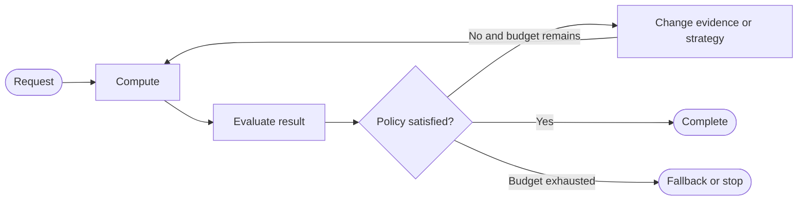

# What Is Graph Engineering?

Graph Engineering is the engineering discipline of designing explicit state, computation, control flow, routing, feedback loops, termination policies, recovery mechanisms, and observability for agentic AI systems represented as executable graphs.

This repository uses the term for that engineering perspective. It does not claim a separate formal academic field, and it does not equate the idea with one framework.

## Definition by Boundary

| Area | Object being engineered | Primary question |
| --- | --- | --- |
| Graph algorithms | Graph-shaped data | How should vertices and edges be traversed or optimized? |
| Knowledge graphs | Entities and relationships | How should connected knowledge be represented? |
| Graph databases | Connected records | How should graph data be stored and queried? |
| Generic DAG pipeline | Ordered tasks | Which fixed dependencies can run? |
| Agent loop | One repeated actor/tool cycle | What should the actor do next? |
| Multi-agent system | Specialized actors | Who performs each responsibility? |
| Graph Engineering | Executable AI control flow | What runs, with what state, under which policy, and when does it stop? |

Graphs for agentic systems may contain cycles, dynamic routes, human gates, and probabilistic computations. That makes them broader than a fixed directed acyclic pipeline.

## Why Agentic Systems Need Explicit Control

A model can propose an action, but reliable systems also need exact answers to operational questions:

- Is the action permitted?
- Which tool should run?
- Can independent work run concurrently?
- Is the result good enough?
- Is a failure semantic or technical?
- Has the retry, time, token, or cost budget been exhausted?
- What path produced the final result?



The graph turns these decisions into inspectable control flow instead of burying them inside a prompt or one large function.

## Framework-Independent First

The smallest useful graph needs only four ideas:

```python
state = {"value": 6}

def classify(state):
    return {"category": "even" if state["value"] % 2 == 0 else "odd"}

def route(state):
    return state["category"]

def multiply(state):
    return {"result": state["value"] * 2}
```

A runtime adds scheduling, state merging, parallel execution, persistence, or visualization. LangGraph is the main reference runtime in this repository, but the architecture remains the same when another runtime—or plain Python—implements it.

## Why It Matters

Explicit topology creates boundaries that can be reasoned about independently:

- node computation can be tested with direct inputs;
- routers can be tested as pure policy functions;
- loops can be proven to have finite budgets;
- reducer behavior can be checked before parallel execution;
- traces can reconstruct decisions after a run.

The goal is not to make every program a graph. Use a graph when branching, iteration, coordination, recovery, or visibility makes explicit control valuable.

## Common Mistake

Do not begin by drawing many agents. Begin with requirements and state transitions. A graph with deterministic functions may be the correct design; adding an LLM changes computation, not the need for control.

Next: [Mental model](01_mental_model.md).
