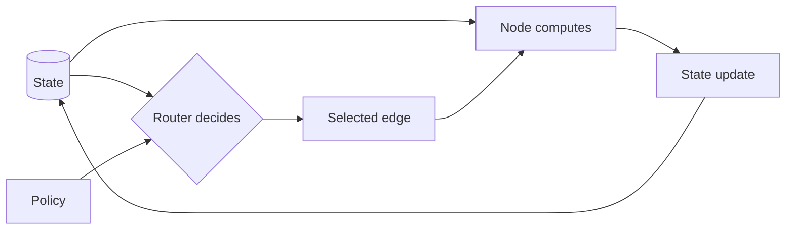

# Mental Model

Graph Engineering separates data, computation, transitions, decisions, and policy so each can be designed and tested deliberately.

## The Five Elements

| Element | Mental model | Contract |
| --- | --- | --- |
| State | Shared working data | Named fields with explicit merge behavior |
| Node | Computation | Read state; return a state update |
| Edge | Execution transition | Schedule a known next node |
| Router | Control decision | Read state; return a named route |
| Policy | Reliability and termination rules | Convert constraints into deterministic decisions |



> **Nodes compute; routers control.**

An evaluator node may compute `score = 0.74`. A router applies `score >= 0.8` and chooses `improve`. Keeping those responsibilities separate makes the threshold visible, deterministic, and easy to test.

## A Node Is Not an Agent

A node may be deterministic Python, a schema validator, a database query, a tool call, a human approval point, an LLM call, a complete agent, or a subgraph. “Agent” describes a computational actor with some autonomy; “node” describes a position in execution topology.

```text
LLMs   → intelligence
Tools  → capabilities
Graph  → control
State  → shared execution context
```

Use an LLM for semantic work such as classification, critique, planning, or generation. Use code for exact calculations, schemas, permissions, budgets, and hard termination limits.

## From Requirement to Topology

Translate requirements into graph elements:

| Requirement | Graph decision |
| --- | --- |
| “Use different research strategies by topic” | Classifier node plus deterministic router |
| “Improve weak answers” | Evaluator, feedback state, bounded loop |
| “Search three independent sources quickly” | Fan-out, reducer, fan-in |
| “Never try more than three times” | Attempt counter and termination policy |
| “Explain what happened” | Trace events and termination reason |

Complexity is justified by a requirement, not by visual symmetry.

## Graph Engineering Is Not LangGraph

LangGraph supplies a useful runtime and vocabulary for compiled state graphs. The engineering choices come first:

1. define the state contract;
2. make node updates explicit;
3. separate decisions from computation;
4. define merge semantics;
5. bound every cycle;
6. select recovery and fallback paths;
7. expose execution evidence.

Those choices survive a framework change. Framework-specific syntax does not.

## Common Mistake

If a diagram says only “Agent A → Agent B → Agent C,” it hides the most important design information: what state crosses boundaries, who chooses each transition, what happens on failure, and why the graph stops.

Next: [State and reducers](02_state_and_reducers.md).
