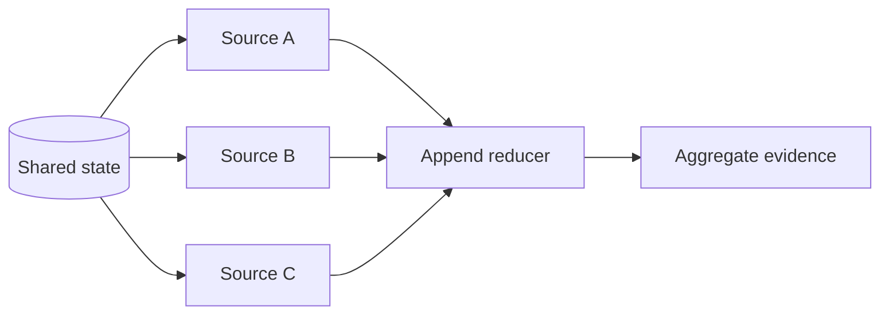

# State and Reducers

State is the data that must survive across execution boundaries. A reducer defines how the runtime combines an existing field with updates from one or more nodes.

## State Is an Interface

Treat graph state like a typed protocol between nodes, not a global scratchpad:

```python
import operator
from typing import Annotated, TypedDict

class ResearchState(TypedDict, total=False):
    question: str
    category: str
    evidence: Annotated[list[str], operator.add]
    score: float
    attempts: int
    trace: Annotated[list[str], operator.add]
```

Each field should have a reason to cross a node boundary. Temporary parsing variables stay local to the node.

## Explicit State Updates

A node should return only the fields it updates:

```python
def classify(state: ResearchState) -> dict:
    category = "weather" if "rain" in state["question"].lower() else "general"
    return {"category": category, "trace": [f"classify:{category}"]}
```

The node does not mutate `state` in place. The returned mapping creates an inspectable boundary for testing, tracing, checkpointing, and replay.

## Reducer Semantics

| Field kind | Typical behavior | Example |
| --- | --- | --- |
| Current fact | Overwrite | `category`, `score`, `status` |
| Counter | Return a new total or use a numeric reducer deliberately | `attempts` |
| Ordered history | Append | `trace`, `messages` |
| Parallel collection | Merge with an associative reducer | `evidence`, `worker_results` |
| Keyed result | Merge by stable key with a conflict rule | `results_by_source` |

Reducers matter even in sequential graphs because they define the meaning of repeated updates. They become critical under parallelism.



For parallel updates, a safe reducer should be deterministic enough for the domain and should usually be associative. If order matters, attach stable source identifiers and sort at fan-in instead of relying on completion order.

## State Scope

Put data in shared state when a later node, router, checkpoint, or observer needs it. Keep data local when it exists only to implement one computation. Large artifacts can be stored externally with references in state when copying them would be costly.

State can also expose sensitive data. Trace and checkpoint policies should define redaction, retention, and access rather than logging every field by default.

## Common Mistake

A “God state” that accumulates every prompt, response, parsed token, and temporary object creates unclear ownership and unbounded growth. Define the minimum cross-boundary contract and compact histories intentionally.

Next: [Nodes, edges, and routers](03_nodes_edges_and_routers.md).
