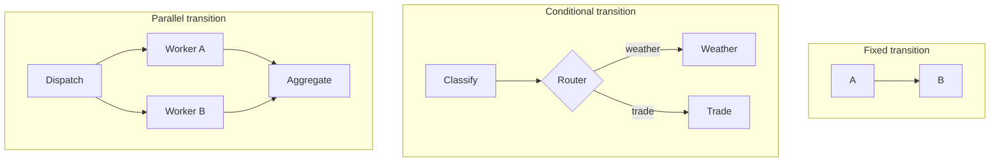

# Nodes, Edges, and Routers

Nodes transform state. Edges express possible transitions. Routers select among conditional edges.

## Node Contract

A well-designed node has one clear responsibility:

```python
def evaluate(state: dict) -> dict:
    score = measure_quality(state["draft"], state["evidence"])
    return {"score": score}
```

Inputs and outputs should be small enough to test directly. Side effects such as sending messages or writing records should be explicit and designed for safe replay.

## Edge Types



A fixed edge represents unconditional sequencing. A conditional edge represents a choice. Parallel edges represent independent work that must later be merged or otherwise coordinated.

## Router Contract

Routers should be small policy functions:

```python
from typing import Literal

def route_category(state: dict) -> Literal["weather", "trade", "politics"]:
    category = state["category"]
    if category not in {"weather", "trade", "politics"}:
        raise ValueError(f"Unsupported category: {category}")
    return category
```

The node that computes `category` may be deterministic or LLM-backed. The router validates the structured value and maps it to a known edge.

## Deterministic and Semantic Routing

| Decision | Suitable implementation |
| --- | --- |
| Topic or intent has ambiguous language | LLM classifier → validated category → code router |
| Retry count below a fixed maximum | Python condition |
| Deadline has passed | Clock comparison |
| Caller has permission | Authorization code |
| Output matches a schema | Schema validation |
| Which strategy fits an open-ended task | Structured semantic classifier, then validation |

Do not ask an LLM to waive a budget, deadline, permission, or hard safety constraint. If semantic judgment influences a high-impact decision, validate its output and retain deterministic policy boundaries.

## Why It Matters

Separating computation from routing allows you to change a classifier without changing the route table, or change a threshold without rewriting the evaluator. It also lets tests cover every route with fixed state.

## Common Mistake

A node that performs work and silently chooses or invokes the next step hides topology from the runtime. Return state updates from nodes and route decisions from routers so the execution path remains visible.

Next: [Feedback loops](04_feedback_loops.md).
