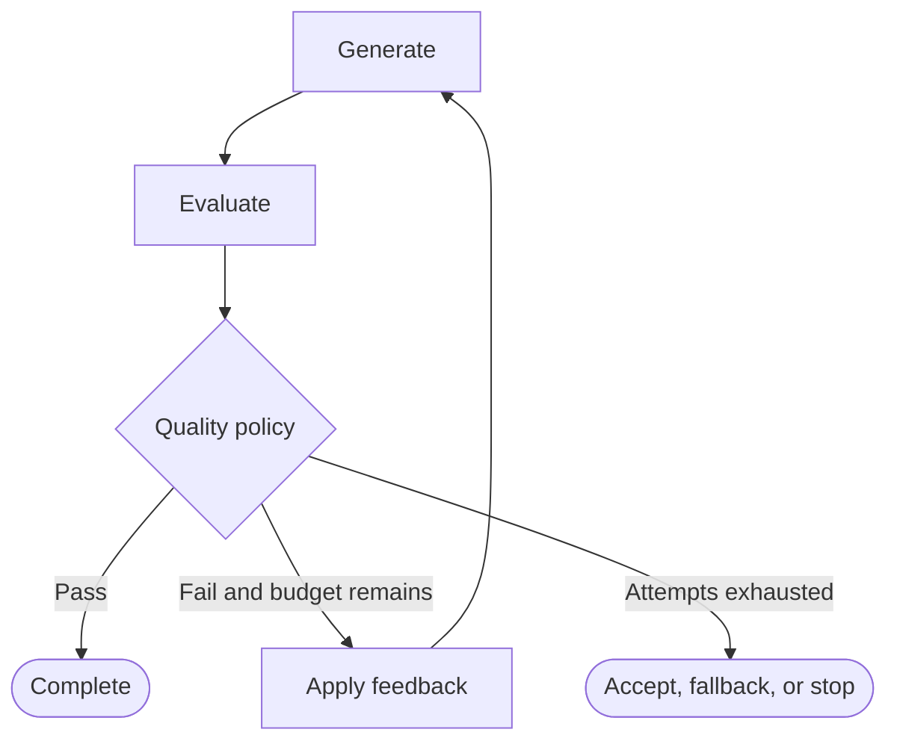

# Feedback Loops

A feedback loop evaluates an output, records actionable information, changes state or strategy, and tries again under a bounded termination policy.

## Evaluator–Optimizer Topology



The evaluator computes evidence such as `score`, `feedback`, or validation errors. The router applies the threshold and attempt budget.

## Retry Is Not Improvement

`Generate → Fail → Generate` is a retry. It may be useful for a transient runtime error, but it is not feedback-driven improvement if nothing changes.

Controlled improvement follows this sequence:

```text
Generate
→ Evaluate
→ Record feedback
→ Change evidence, constraints, plan, tool, or strategy
→ Generate again
```

Each failed iteration should introduce information capable of changing the next result.

## Termination Policy

Every cycle needs both a success condition and a safety condition:

```python
QUALITY_THRESHOLD = 0.8
MAX_ATTEMPTS = 3

def route_after_evaluation(state: dict) -> str:
    if state["score"] >= QUALITY_THRESHOLD:
        return "complete"
    if state["attempts"] >= MAX_ATTEMPTS:
        return "fallback"
    return "improve"
```

Other limits may include elapsed time, deadline, token usage, cost, cancellation, or an unrecoverable failure. Record the final reason, not only the final output.

## Designing Feedback

Useful feedback is specific enough for the optimizer to act on. “Try again” carries little information. “The claim about tariffs lacks evidence; retrieve one trade-policy source and narrow the conclusion” changes both evidence and strategy.

Avoid unbounded context growth. Keep the latest actionable feedback, summarize earlier attempts, and retain only audit data required by the application.

## Common Mistake

A recursion limit in the runtime is an emergency guard, not the graph’s business termination policy. Encode limits in state and routes so tests can verify why the loop stopped.

Next: [Parallelism](05_parallelism.md).
