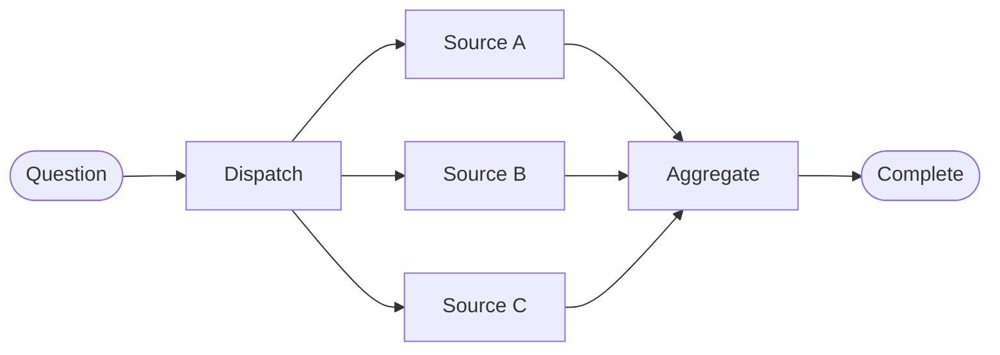

# Parallelism

Fan-out schedules independent work from a common state. Fan-in waits for the required branches and combines their updates before downstream computation continues.

## Fan-Out and Fan-In



Parallelism can reduce wall-clock latency when branch work is independent and external capacity permits concurrency. It does not make dependent operations independent, reduce total compute, or guarantee lower cost.

## Independence Test

Two nodes are candidates for parallel execution when:

- neither reads the other’s result;
- their side effects do not conflict;
- their updates have compatible reducer semantics;
- the fan-in policy can handle missing, late, or duplicate work;
- running both is worth the resource cost.

If source B needs source A’s extracted entities, they belong in sequence.

## Safe Merge Strategy

Append reducers are convenient for evidence, but completion order can vary. Attach stable identity and sort at aggregation:

```python
from typing import Annotated, TypedDict
import operator

class ParallelState(TypedDict, total=False):
    results: Annotated[list[tuple[str, str]], operator.add]

def source_a(_: ParallelState) -> dict:
    return {"results": [("a", "evidence from A")]}

def aggregate(state: ParallelState) -> dict:
    ordered = sorted(state["results"], key=lambda item: item[0])
    return {"evidence": [text for _, text in ordered]}
```

For keyed data, define whether duplicate keys are rejected, overwritten by priority, or reconciled. Never let an accidental last-writer-wins rule determine correctness.

## Fan-In and Partial Failure

Decide whether aggregation requires all branches, a quorum, or any successful branch. A failure policy may retry only the failed source, continue with a warning, substitute a fallback, or abort the whole run. Record which sources contributed so consumers can judge coverage.

Fan-in is also a synchronization boundary. Downstream nodes should not read partial shared state unless the topology deliberately supports streaming or incremental aggregation.

## Common Mistake

Adding parallel syntax without defining reducer, synchronization, and partial-failure behavior creates races rather than a designed topology.

Next: [Reliability](06_reliability.md).
