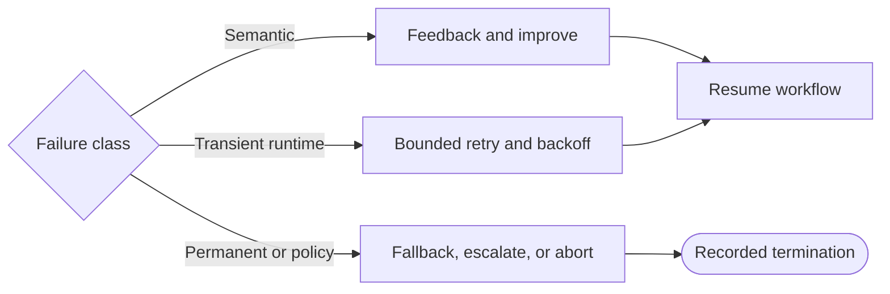

# Reliability

Reliable graphs classify failures before choosing recovery. A weak answer and a network timeout are different events and need different state, budgets, and routes.

## Failure Taxonomy

| Class | Examples | Typical policy |
| --- | --- | --- |
| Semantic | Low quality, insufficient evidence, failed evaluation, invalid reasoning | Feedback, retrieve, revise, or accept explicitly |
| Transient runtime | Timeout, rate limit, temporary network error | Bounded retry and backoff |
| Permanent runtime | Permission denied, unsupported operation, invalid credentials | Fallback, abort, or escalate |
| Contract | Invalid schema, malformed tool output | Repair if safe and bounded; otherwise fail clearly |
| Cancellation or budget | Deadline, token, cost, or caller cancellation | Terminate and record reason |

## Budgets and Bounds

A graph may enforce several independent limits:

- retry budget per dependency and per run;
- semantic-improvement attempts;
- node timeout and whole-run deadline;
- token and cost budgets;
- recursion or node-visit guard;
- human review deadline.

The router should check the authoritative counter or timestamp. An LLM may describe a failure, but code decides whether a hard limit has been reached.

## Retry Policy

Retry only operations likely to recover. Use bounded exponential backoff with jitter for rate limits or transient network errors when the provider’s guidance permits it. Avoid retrying invalid permissions or deterministic schema bugs without a state change.

Side effects need idempotency. A resumed or retried node must not send the same message, charge the same payment, or create the same record twice. Store an idempotency key or split preparation from the irreversible action.

## Fallback and Termination

A fallback may use cached data, a secondary provider, a deterministic answer, a partial result, or human escalation. It should state reduced capability rather than silently pretending success.

Useful termination reasons include `quality_reached`, `attempt_budget_exhausted`, `deadline_exceeded`, `permanent_error`, `cancelled`, and `human_rejected`.

## Common Mistake

One generic “retry” edge erases the difference between content improvement and runtime recovery. Separate counters, feedback, backoff, and exhausted paths.

Next: [Observability](07_observability.md).
