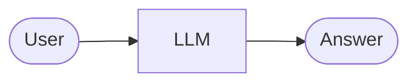
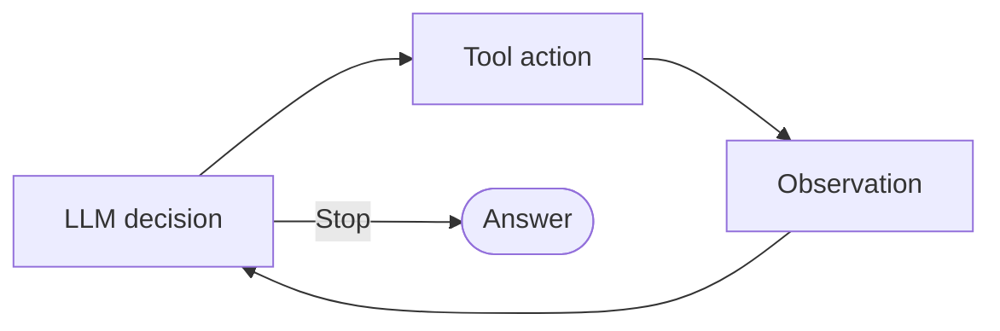
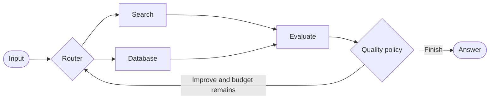
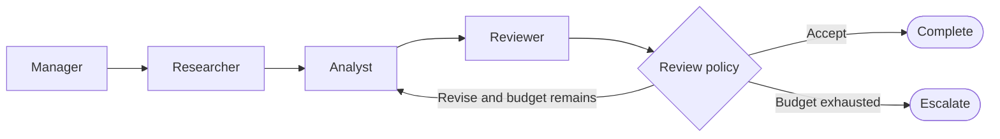

# Graphs, Agents, and Multi-Agent Systems

An agent is a computational actor. A graph is a control structure. Multi-agent design is an architectural strategy for specialization and communication. They are related, not equivalent.

## Plain LLM

One semantic computation is enough when no tool use, feedback, branching, or recovery is needed.

## Agent Loop

An agent loop provides repeated reasoning and action. Its policy may be implicit unless budgets and stop conditions are enforced outside the model.

## Graph

The graph exposes state transitions, routes, and policy. Its nodes can contain zero agents.

## Multi-Agent Graph

Here the graph controls collaboration among specialized actors. The agents may themselves use tools or internal loops, but their input/output contracts and the parent graph’s limits remain explicit.

## Choosing the Architecture

| Need | Smallest suitable design |
| --- | --- |
| One transformation | Plain model call or deterministic function |
| Open-ended tool use by one actor | Bounded agent loop |
| Known branches, gates, or recovery policy | Graph |
| Specialization requiring distinct contexts or ownership | Multi-agent graph |

Do not create extra agents for calculators, validators, routers, or retry counters when code is clearer. Multiple prompts with role names do not automatically create useful specialization.

## Common Mistake

A supervisor everywhere becomes a probabilistic router and a bottleneck. Use deterministic edges for known transitions; add semantic coordination only where the choice genuinely requires it.

Next: [Testing graphs](09_testing_graphs.md).
