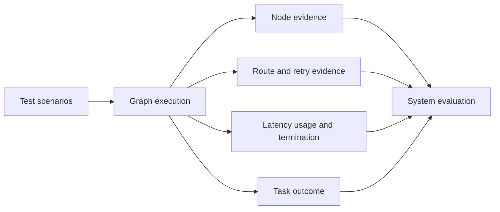

# Evaluating Graph Systems

Model answer quality is one component of graph quality. A graph is a running system: it routes, retries, calls tools, spends budgets, pauses, falls back, and terminates. Evaluation must measure those behaviors as well as the final artifact.

For example, “answer quality = 90%” is insufficient if 20% of runs never terminate, 30% take unnecessary retries, or 40% select the wrong expensive tool.

## Evaluation Model

Evaluate at four related levels:

| Level | Question | Example evidence |
| --- | --- | --- |
| Computation | Did a node produce a valid update? | Schema validity, grounded draft, tool response |
| Control | Did policy choose the correct next step? | Route accuracy, retry decision, approval gate |
| Execution | Did the run finish safely within bounds? | Termination, latency, calls, budgets, side effects |
| Outcome | Did the system solve the task? | Task success, human rating, business acceptance |

## Core Metrics

| Metric | Definition | What it can reveal |
| --- | --- | --- |
| Task success rate | Successful tasks / evaluated tasks | End-to-end usefulness |
| Termination success rate | Runs ending through an intended terminal state / runs | Loops and runtime escapes |
| Fallback rate | Runs using fallback / runs | Brittle primary paths or conservative policy |
| Retry distribution | Retry count per run and by failure class | Waste, recovery behavior, tail risk |
| Route accuracy | Correct policy routes / labeled route decisions | Misclassification or invalid control |
| Tool recovery rate | Recovered transient tool failures / recoverable failures | Runtime resilience |
| Latency | End-to-end and per-node duration distributions | Bottlenecks and slow fallbacks |
| LLM calls per task | Model invocations / run | Unnecessary semantic work |
| Token usage and estimated cost | Usage and cost per run or success | Efficiency and budget compliance |
| Human escalation rate | Runs sent to review / runs | Risk-policy load and reviewer capacity |

Always segment aggregate metrics by route, outcome, failure kind, and graph version. An average retry count can hide one branch that repeatedly exhausts its budget.

## Scenario Suite

Use deterministic scenarios for control policy and separate live-model evaluations for semantic capability.

| Scenario | Expected route or invariant |
| --- | --- |
| Happy path | Direct success and explicit termination |
| Semantic failure | Feedback changes evidence or strategy before retry |
| Transient runtime failure | Retry count stays within runtime budget |
| Permanent runtime failure | Immediate fallback with zero retries |
| Parallel partial failure | Successful branch results reach aggregation |
| Checkpoint and resume | Same thread continues without replaying completed nodes |
| Human approval | Pause occurs before protected action; approval resumes it |
| Human rejection | Protected action never executes |
| Invalid agent delegation | Allow-listed fallback receives the handoff |
| Excess discoveries | Dynamic fan-out never exceeds its configured maximum |

The repository test suite implements these as ordinary pytest cases. A bespoke evaluation framework is unnecessary at this stage.

## Assertions Before Scores

Some properties are invariants, not averages:

- permanent failures must not be retried;
- protected actions must not execute before required approval;
- an idempotency key must not produce the simulated action twice;
- retries, fan-out, depth, and revision loops must never exceed their limits;
- every completed run must record a termination reason;
- parent graphs must receive only documented child outputs;
- tools and agent routes must come from explicit allow-lists.

A single invariant violation should fail the scenario even when the final text looks good.

## Comparing Graph Versions

Keep the scenario set fixed, record the graph version, and compare tradeoffs rather than one headline score. Adding an evaluator may raise task success while increasing calls and latency. Parallel research may reduce latency but increase partial failures. A human gate may reduce unsafe execution while increasing time-to-completion.

Choose a version only after defining acceptable boundaries for success, safety, latency, usage, and escalation. Optimization without explicit acceptance criteria often moves cost from one metric to another.

## Production Considerations

This repository uses small in-memory traces and deterministic fakes to teach policy. Production evaluation may require durable event storage, dataset versioning, privacy controls, sampling, statistical uncertainty, and provider-specific usage reconciliation. Those systems are intentionally outside this repository’s scope.

Continue with the [Graph Engineering checklist](graph_engineering_checklist.md), especially its reliability, persistence, observability, and testing checks.
