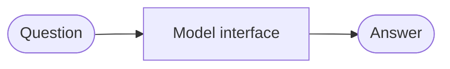
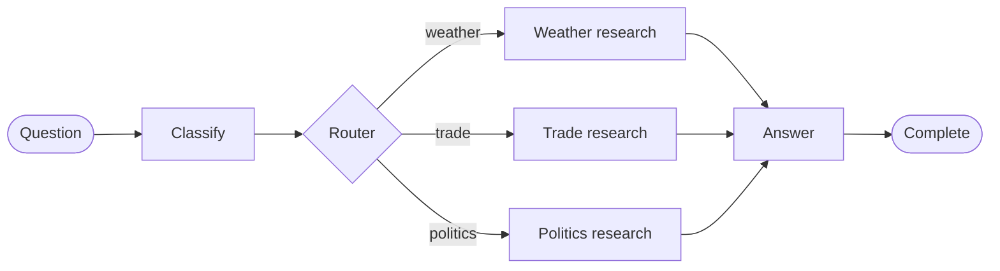
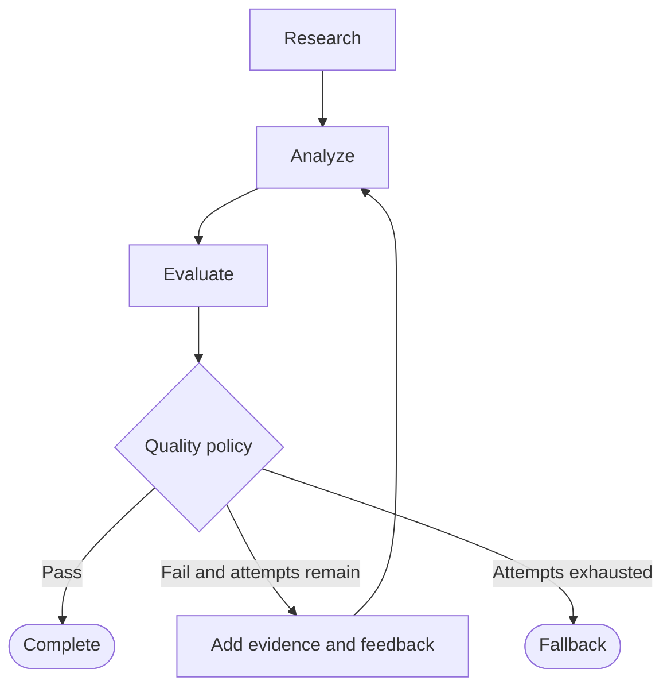
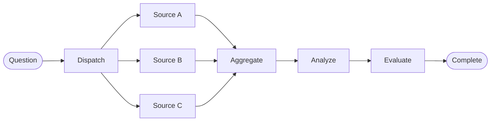
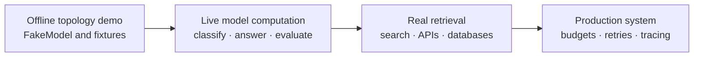

# Progressive Research Agent

This example teaches how graph topology evolves from V0 to V4 as system requirements grow.

> **Important — this is currently a deterministic graph simulation.** The default example does not call DeepSeek, OpenAI, a search engine, a database, or any external API. Its answers, evidence, categories, scores, feedback, and source results are produced by `FakeModel` and hard-coded fixtures. They exist to make graph control flow reproducible—not to provide factual research.

## Purpose and Boundaries

The example isolates graph architecture from model quality so readers can inspect routing, state updates, feedback loops, termination, and parallel reducers without credentials or nondeterministic output.

| Capability | Current implementation | Real system equivalent |
| --- | --- | --- |
| Answer generation | `FakeModel.answer()` joins the question, evidence, and feedback into a string | LLM call |
| Topic classification | Keyword matching; unmatched text defaults to `politics` | Structured LLM classifier or trained classifier |
| Research evidence | Fixed strings in `GENERAL_EVIDENCE` and `EVIDENCE` | Search, database, retriever, or domain API |
| Evaluation | `0.65` with fewer than three evidence items; otherwise `0.90` | LLM evaluator, rules, tests, or domain metrics |
| Improvement | Adds one fixed follow-up evidence string | New retrieval, revised plan, changed tool, or actionable feedback |
| Parallel sources | Three fixed `Source A/B/C` strings | Independent retrieval or tool calls |
| Routing and termination | Real deterministic graph policy | Keep deterministic in production |

The graph topology is executable and real. The intelligence and research data are simulated.

## What Happens When You Change the Question?

Changing `QUESTION` does not currently produce a genuinely researched answer:

| Version | Current behavior after changing the question |
| ---: | --- |
| V0 | Echoes the new question with `No external evidence.` |
| V1 | Reuses the same two generic evidence strings for every question |
| V2 | Selects `weather` or `trade` only when known keywords match; everything else becomes `politics` |
| V3 | Uses the same keyword classification, fixed evidence, fixed feedback, and deterministic score progression |
| V4 | Reuses the same three source strings regardless of the question |

This behavior is intentional for an offline topology lesson, but it is not suitable for answering arbitrary user questions.

## Why Keep an Offline Version?

`FakeModel` is useful even after a live implementation exists:

- tests remain fast and deterministic;
- contributors need no API key;
- graph routing and termination can be tested separately from model quality;
- examples cannot unexpectedly spend money or hit provider limits;
- regressions show whether graph policy or model behavior changed.

Use the fake for architecture tests. Use a provider-backed model and real retrieval for application behavior.

## Run the Offline Demo

Open [`run.ipynb`](run.ipynb), change `QUESTION` in the first cell, and run all cells. The following five cells execute V0 through V4 with the same question, making their state, trace, and simulated output directly comparable.

The notebook includes saved deterministic outputs, so GitHub visitors can inspect the progression without an API key or local execution. To experiment locally from the repository root:

```bash
uv sync
uv run jupyter lab examples/research_agent/run.ipynb
```

## V0 — One Model Interface

Requirement: answer a question. No graph is needed yet.



Current implementation: `run_v0()` creates `FakeModel` by default. `FakeModel.answer()` performs string formatting; it does not call an LLM.

Architectural lesson: the `ResearchModel` protocol lets a fake or real provider implement the same computation without changing callers.

## V1 — Research Before Answering

New requirement: ground the answer in evidence. A fixed research step appears.


Current implementation: the research node returns the same `GENERAL_EVIDENCE` list for every question. Only the topology and state transition are real; the evidence is a fixture.

Architectural lesson: state now carries `question`, `evidence`, `final_answer`, `trace`, and `termination_reason` across node boundaries.

## V2 — Route by Topic

New requirement: use topic-specific research. A classifier computes a category; a deterministic router selects the edge.



Current implementation: `FakeModel.classify()` calls `classify_keywords()`. Questions without recognized weather or trade keywords default to `politics`. Each branch returns a fixed `EVIDENCE` list.

Architectural lesson: semantic classification and deterministic routing are separate responsibilities. A live classifier may be probabilistic; the allowed categories and route table should remain code.

## V3 — Evaluate and Improve

New requirement: weak analysis should improve. Evaluation produces a score and feedback; policy requires `score >= 0.8` or stops after three attempts.



Current implementation: the fake evaluator returns `0.65` when fewer than three evidence items exist and `0.90` otherwise. The improvement node appends one fixed sentence, so the second evaluation passes predictably.

Architectural lesson: feedback changes state before another attempt, and `MAX_ATTEMPTS` provides bounded termination. A live model must not control whether the hard attempt limit is exceeded.

## V4 — Parallel Evidence Gathering

New requirement: gather three independent sources with lower wall-clock latency and broader coverage. The graph adds fan-out, reducer-backed updates, and fan-in.



Current implementation: the three source nodes return hard-coded strings. No search requests run. `source_results` uses an append reducer, and aggregation sorts stable source identifiers so evidence order does not depend on completion timing.

Architectural lesson: production fan-out must also define source timeouts, concurrency limits, retries, partial-failure policy, and provenance.

## What the Versions Teach

| Version | Requirement added | Topology added | Simulated component |
| ---: | --- | --- | --- |
| V0 | Produce an answer | None; one model interface | Answer generation |
| V1 | Ground in evidence | Fixed sequence | Evidence and answer |
| V2 | Select domain strategy | Classifier and router | Classification, evidence, answer |
| V3 | Meet a quality bar | Evaluator, feedback, bounded loop | Classification, evidence, generation, evaluation |
| V4 | Gather independent evidence efficiently | Fan-out, reducer, fan-in | All source results, generation, evaluation |

Graph complexity grows because requirements grow. Do not start at V4 when V1 solves the actual problem.

## From Demo to a Real System

Upgrading the example has distinct levels. Replacing the fake model does not automatically create real research.



| Level | Add | What becomes real | What remains simulated |
| ---: | --- | --- | --- |
| 1 | Current `FakeModel` | Graph state and control flow | Intelligence and evidence |
| 2 | `DeepSeekResearchModel` | Classification, answering, evaluation | Research evidence and sources |
| 3 | Search/retrieval tools | Evidence, source content, provenance | Only fixtures retained for tests |
| 4 | Reliability and observability | Operational behavior | Nothing required for the live path |

### Step 1 — Configure DeepSeek

Copy the placeholder environment file and set your own key locally:

```bash
cp .env.example .env
```

```dotenv
DEEPSEEK_API_KEY=your_real_key_here
DEEPSEEK_MODEL=deepseek-v4-flash
DEEPSEEK_BASE_URL=https://api.deepseek.com
```

`.env` is ignored by Git. Never place a key in the notebook, README, source code, saved outputs, or committed files.

### Step 2 — Implement the Model Protocol

A live adapter must implement `classify()`, `answer()`, and `evaluate()`. The example below uses the repository’s existing DeepSeek/OpenAI-compatible helper. Put production code in a module such as `examples/research_agent/deepseek_model.py`, not directly in every graph node.

```python
import json

from graph_engineering.control import route_category
from graph_engineering.llm import DeepSeekSettings, chat


class DeepSeekResearchModel:
    def __init__(self, client, settings: DeepSeekSettings):
        self.client = client
        self.settings = settings

    def classify(self, question: str) -> str:
        payload = chat(
            self.client,
            self.settings,
            system_prompt=(
                "Classify the question. Return JSON with exactly one category: "
                "weather, trade, or politics."
            ),
            user_prompt=(
                'Return exactly {"category": "<category>"} for: ' + question
            ),
            json_mode=True,
            max_tokens=100,
        )
        if not isinstance(payload, dict):
            raise ValueError(f"Expected a JSON object, received: {payload!r}")

        category = str(payload.get("category", "")).casefold().strip()
        return route_category({"category": category})

    def answer(
        self,
        question: str,
        evidence: list[str],
        feedback: str = "",
    ) -> str:
        result = chat(
            self.client,
            self.settings,
            system_prompt="Answer only from the supplied evidence.",
            user_prompt=(
                f"Question: {question}\n"
                f"Evidence: {json.dumps(evidence)}\n"
                f"Previous feedback: {feedback or 'None'}"
            ),
            max_tokens=500,
        )
        if not isinstance(result, str):
            raise TypeError("Expected a text answer from DeepSeek.")
        return result

    def evaluate(self, answer: str, evidence: list[str]) -> tuple[float, str]:
        payload = chat(
            self.client,
            self.settings,
            system_prompt=(
                "Evaluate evidence support. Return JSON with numeric score from "
                "0 to 1 and actionable feedback."
            ),
            user_prompt=(
                f"Evidence: {json.dumps(evidence)}\n"
                f"Answer: {answer}\n"
                'Return exactly {"score": 0.0, "feedback": "..."}.'
            ),
            json_mode=True,
            max_tokens=200,
        )
        if not isinstance(payload, dict):
            raise ValueError(f"Expected a JSON object, received: {payload!r}")

        score = max(0.0, min(1.0, float(payload["score"])))
        feedback = str(payload.get("feedback", "No feedback provided."))
        return score, feedback
```

### Step 3 — Initialize and Inject the Live Model

Provider initialization stays outside `versions.py`. The graph receives a model implementation through its existing protocol:

```python
from pathlib import Path

from examples.research_agent.deepseek_model import DeepSeekResearchModel
from examples.research_agent.versions import build_version, run_v0
from graph_engineering.llm import DeepSeekSettings, create_deepseek_client

settings = DeepSeekSettings.from_env(Path(".env"))
client = create_deepseek_client(settings, required=True)
assert client is not None
model = DeepSeekResearchModel(client, settings)

question = "How can heatwaves affect electricity demand?"

print(run_v0(question, model=model))

graph = build_version(3, model=model)
result = graph.invoke({"question": question, "attempts": 0, "trace": []})
print(result["final_answer"])
```

Pass the same model into any version:

```python
build_version(1, model=model)
build_version(2, model=model)
build_version(3, model=model)
build_version(4, model=model)
```

With this change, model computation is live. Evidence is still hard-coded until the research nodes are replaced.

### Step 4 — Replace Fixtures with Real Retrieval

For actual research, replace `GENERAL_EVIDENCE`, `EVIDENCE`, and the V4 source functions with search, database, retriever, or domain-API calls.

A retrieval node should return evidence with provenance rather than anonymous text:

```python
def search_source(state: ResearchState) -> dict:
    documents = search_client.search(state["question"])
    return {
        "source_results": [
            {
                "source": document.url,
                "title": document.title,
                "content": document.snippet,
                "retrieved_at": document.retrieved_at,
            }
            for document in documents
        ],
        "trace": ["search_source"],
    }
```

This sketch requires a corresponding state/reducer change because the current example stores `source_results` as `list[tuple[str, str]]`. Define deduplication, source trust, freshness, citation, timeout, and partial-failure policies before treating retrieved text as evidence.

### Step 5 — Keep Hard Policy Outside the LLM

Even with a live provider, these rules should remain deterministic:

- allowed route names;
- `QUALITY_THRESHOLD` and `MAX_ATTEMPTS`;
- retry and timeout budgets;
- token and cost limits;
- permissions and safety constraints;
- fallback and termination reasons.

The LLM computes classification, answers, and evaluation data. The graph validates those values and owns control.

## API Calls, Cost, and Reliability

A live adapter changes the operational profile:

| Version | Approximate model calls with the current topology |
| ---: | ---: |
| V0 | 1 answer call |
| V1 | 1 answer call |
| V2 | 1 classification + 1 answer call |
| V3 | 1 classification + up to 3 answer/evaluation pairs |
| V4 | 1 answer + 1 evaluation call |

Retrieval calls are additional. Exact token use and cost depend on the provider, model, prompts, evidence size, and number of feedback iterations.

Before enabling live execution:

- keep API keys only in `.env`;
- use provider and graph timeouts;
- bound retries and feedback attempts;
- record model calls, tokens, estimated cost, and termination reason;
- redact sensitive prompts and evidence from logs;
- make tool side effects safe to retry;
- handle invalid JSON and unsupported categories explicitly.

## Recommended Testing Strategy

Keep both implementations:

| Test type | Model | External retrieval | Purpose |
| --- | --- | --- | --- |
| Unit and graph-policy tests | `FakeModel` | Fixtures | Fast, deterministic routing and termination checks |
| Provider contract tests | Mocked DeepSeek response | Fixtures | Validate parsing and failure mapping |
| Retrieval integration tests | Fake or recorded model | Test search/data source | Validate provenance and merge behavior |
| Live evaluation | `DeepSeekResearchModel` | Real tools | Measure answer quality, latency, and cost |

The default automated test suite should remain offline. Live tests should be opt-in and clearly identified because they use credentials, network access, time, and money.

## Reader Checklist

Before interpreting an output, ask:

- Is the active model `FakeModel` or a provider-backed implementation?
- Is evidence a fixture or retrieved from a real source?
- Are displayed scores deterministic or model-generated?
- Are citations and provenance present?
- Are retries, budgets, and termination reasons visible?

If the answer, evidence, or score came from `FakeModel` or a fixture, treat it as a topology demonstration—not a factual research result.
