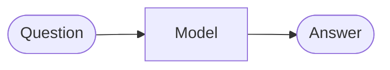
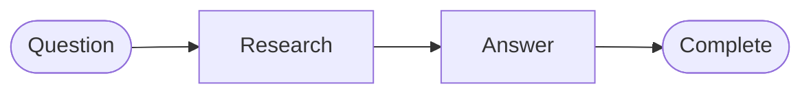

# Progressive Research Agent

This example evolves one research system as its requirements grow. It uses a deterministic `FakeModel`, so every version runs without network access or an API key. The fake implements semantic capabilities; the graph’s routing, merge, loop, and termination policies remain ordinary code.

## Run It

From the repository root:

```bash
uv run python -m examples.research_agent.run --version 0
uv run python -m examples.research_agent.run --version 1
uv run python -m examples.research_agent.run --version 2
uv run python -m examples.research_agent.run --version 3
uv run python -m examples.research_agent.run --version 4
```

Change the question with `--question "How could a tariff affect imports?"`.

## V0 — One Semantic Computation

Requirement: answer a question. No graph is needed yet.



`run_v0` accepts the `ResearchModel` protocol, so a real LLM or the deterministic fake can provide intelligence without owning control policy.

## V1 — Research Before Answering

New requirement: ground the answer in evidence. A fixed research step appears.



State now carries `question`, `evidence`, `final_answer`, `trace`, and `termination_reason` across node boundaries.

## V2 — Route by Topic

New requirement: use topic-specific research. A semantic classifier computes a structured category; a deterministic router selects the edge.


The classifier may be probabilistic. The allowed categories and edge mapping are code.

## V3 — Evaluate and Improve

New requirement: weak analysis should improve. Evaluation produces a score and feedback; policy requires `score >= 0.8` or stops after three attempts.


This is feedback-driven improvement because the next attempt receives both evaluator feedback and additional evidence. `MAX_ATTEMPTS` prevents an unbounded cycle.

## V4 — Parallel Evidence Gathering

New requirement: gather three independent sources with lower wall-clock latency and broader coverage. The graph adds fan-out, reducer-backed updates, and fan-in.


`source_results` uses an append reducer. `aggregate` sorts stable source identifiers so downstream evidence order does not depend on completion timing. A production version would additionally define per-source timeout, concurrency, and partial-failure policy.

## What the Versions Teach

| Version | Requirement added | Topology added |
| ---: | --- | --- |
| V0 | Produce an answer | None; one call |
| V1 | Ground in evidence | Fixed sequence |
| V2 | Select domain strategy | Classifier and router |
| V3 | Meet a quality bar | Evaluator, feedback, bounded loop |
| V4 | Gather independent evidence efficiently | Fan-out, reducer, fan-in |

Graph complexity grows because system requirements grow. Do not start at V4 when V1 solves the problem.

## Replace the Fake Model

Implement the three methods in `ResearchModel`: `classify`, `answer`, and `evaluate`. Provider-specific setup belongs outside `versions.py`; the reusable DeepSeek helper is in [`src/graph_engineering/llm.py`](../../src/graph_engineering/llm.py). The route table, attempt budget, reducers, and termination reasons should remain provider-independent.
