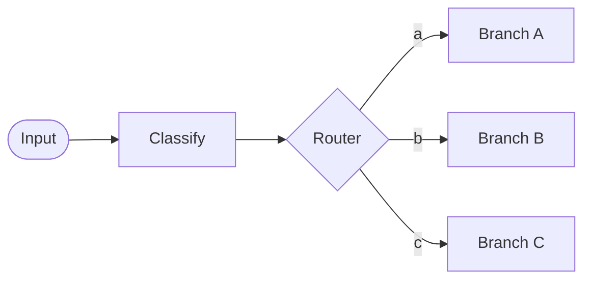
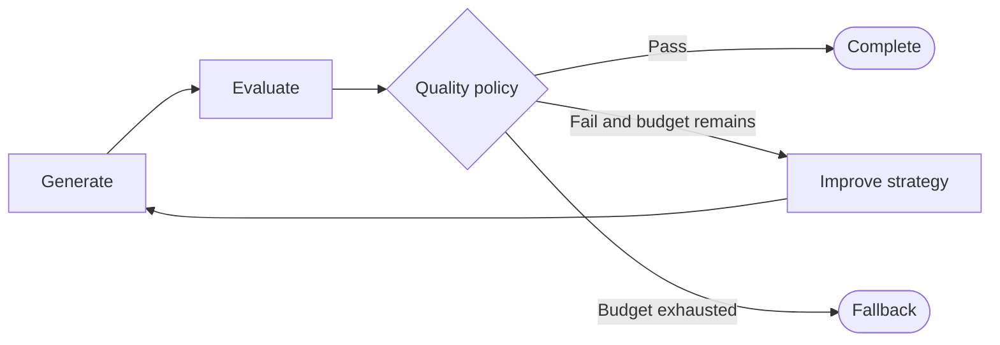
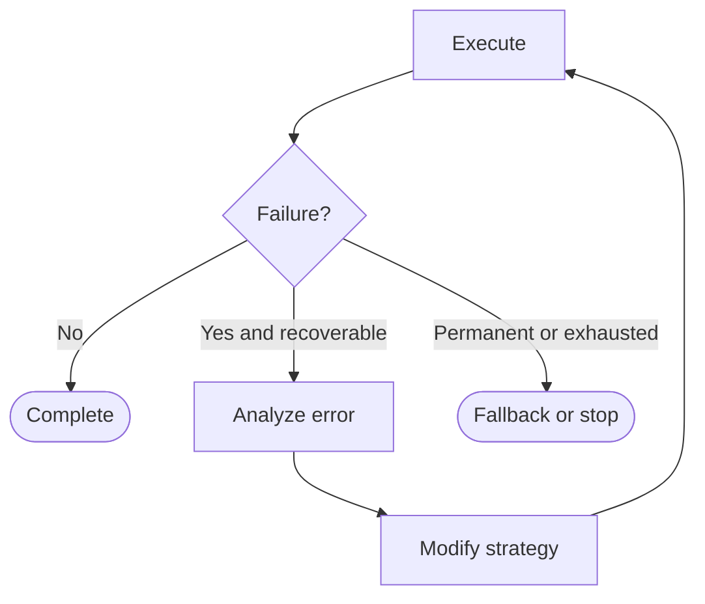
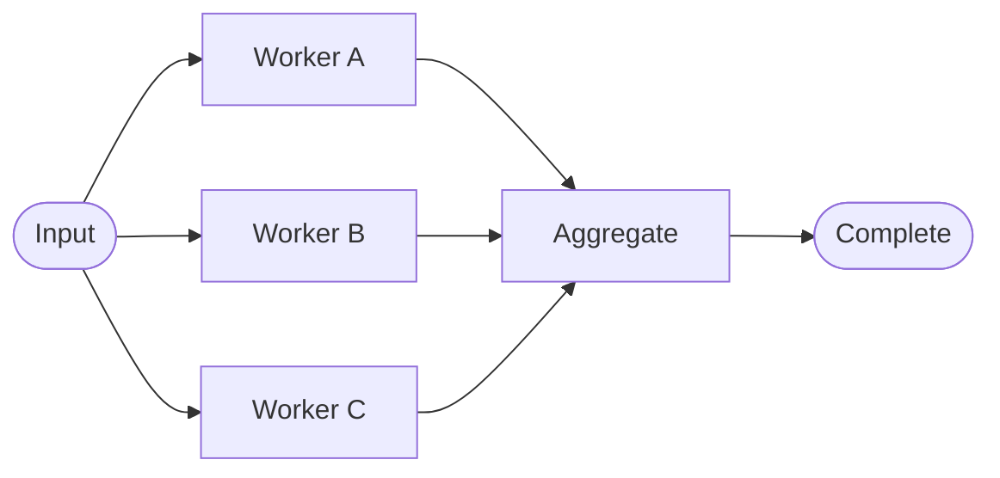
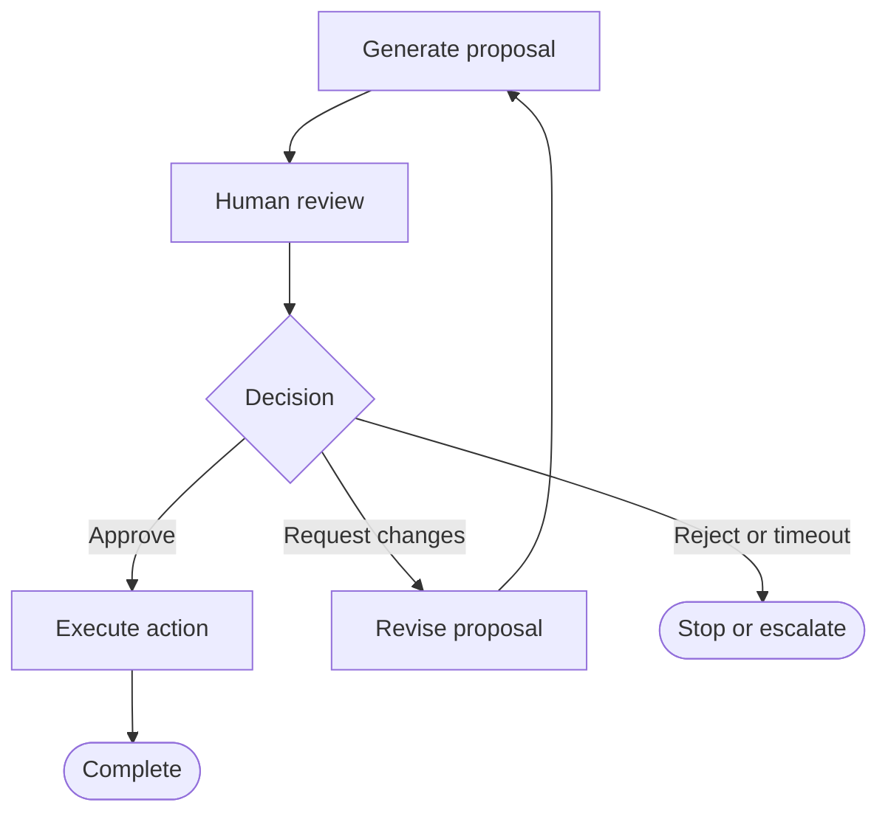
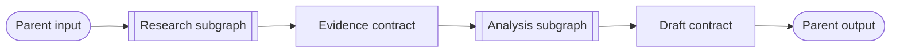
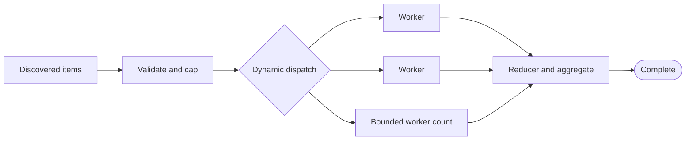
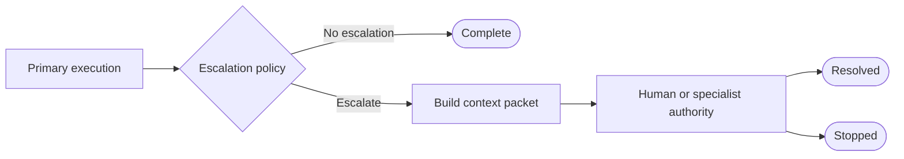
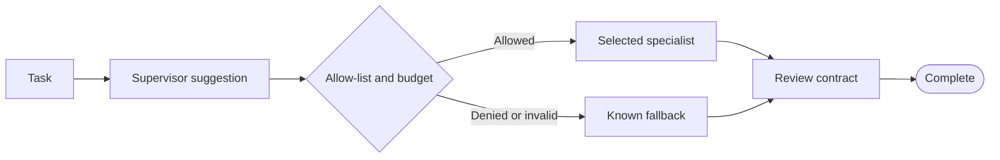

# Graph Engineering Pattern Library

Patterns are reusable execution topologies. They describe state and control decisions first; a framework supplies the runtime syntax afterward.

| Pattern | Primary problem | Characteristic control |
| --- | --- | --- |
| [Router](#router) | Select one strategy at runtime | Conditional edge |
| [Evaluator–Optimizer](#evaluatoroptimizer) | Improve work until acceptable | Quality gate and bounded loop |
| [Retry with Feedback](#retry-with-feedback) | Recover by changing a failed strategy | Error analysis and bounded loop |
| [Fan-Out/Fan-In](#fan-outfan-in) | Run independent work concurrently | Parallel edges, reducer, synchronization |
| [Human Gate](#human-gate) | Require accountable approval | Pause, decision, revision, or execution |
| [Subgraph / Hierarchical Graph](#subgraph--hierarchical-graph) | Isolate a reusable responsibility | Explicit parent-child contract |
| [Dynamic Map-Reduce](#dynamic-map-reduce) | Dispatch runtime-discovered work | Bounded dispatch, reducer, fan-in |
| [Escalation](#escalation) | Transfer unresolved work to a stronger authority | Trigger, context packet, terminal ownership |
| [Guarded Supervisor](#guarded-supervisor) | Delegate among specialized actors | Semantic suggestion plus deterministic allow-list |

## Router

### Problem

The next execution strategy depends on runtime state, such as topic, request type, risk, or capability.

### Mental model

A classifier computes a structured fact. A router validates that fact and selects a known edge.



### When to use

Use a router when branches have meaningfully different computation, tools, cost, risk, or state requirements.

### When not to use

Do not add routing when all paths perform the same work, or when a direct function call expresses a trivial implementation detail more clearly.

### State requirements

Store the validated routing field, optional confidence or reason, and a trace entry. Define an `unknown` or invalid-category policy.

### Termination considerations

A one-way router has no cycle. If a branch returns to classification, bound reclassification attempts and require a state change.

### Minimal code example

```python
ALLOWED = {"weather", "trade", "politics"}

def classify(state: dict) -> dict:
    text = state["question"].lower()
    category = "weather" if "rain" in text else "trade" if "tariff" in text else "politics"
    return {"category": category}

def route(state: dict) -> str:
    category = state["category"]
    if category not in ALLOWED:
        raise ValueError(f"Unsupported category: {category}")
    return category
```

### Production considerations

Track route distribution and invalid outputs. Validate LLM-produced categories against a schema. Apply permissions, budgets, and safety constraints after semantic classification in deterministic code.

## Evaluator–Optimizer

### Problem

One generation pass may not meet a measurable quality standard.

### Mental model

Generation produces work, evaluation produces assessment data, and a policy decides whether to complete, improve, or stop at the budget.



### When to use

Use it when evaluation criteria are meaningful and another iteration can use feedback to improve the result.

### When not to use

Do not loop when evaluation is unreliable, the task is low-value, latency is strict, or the optimizer cannot act on the feedback.

### State requirements

Keep the current artifact, score or validation result, actionable feedback, attempt count, quality threshold, and termination reason. Compact older drafts unless the application needs them.

### Termination considerations

Terminate on quality success and on a maximum attempt, deadline, token, or cost bound. Define whether exhaustion accepts the best result, uses a fallback, or escalates.

### Minimal code example

```python
QUALITY_THRESHOLD = 0.8
MAX_ATTEMPTS = 3

def quality_route(state: dict) -> str:
    if state["score"] >= QUALITY_THRESHOLD:
        return "complete"
    if state["attempts"] >= MAX_ATTEMPTS:
        return "fallback"
    return "improve"
```

### Production considerations

Version evaluator criteria, record score distributions and attempt counts, avoid evaluator/optimizer prompt coupling, and reserve a runtime guard above the business limit.

## Retry with Feedback

### Problem

Execution failed in a way that may be recoverable only after the error is understood and the strategy changes.

### Mental model

The loop is not “run again.” It is “classify the failure, derive an actionable change, then execute under a remaining budget.”



### When to use

Use it for semantic failures or structured runtime failures where the next action can change tool, arguments, evidence, format, or execution plan.

### When not to use

Do not retry permanent permission failures, deterministic bugs, or identical semantic requests with no new information.

### State requirements

Store a failure class, sanitized error details, attempt count, revised strategy, and the last successful checkpoint or artifact when relevant.

### Termination considerations

Use separate retry budgets for semantic and runtime failures. Stop on permanent failure, exhausted budget, deadline, cancellation, or a successful execution.

### Minimal code example

```python
def failure_route(state: dict) -> str:
    if state.get("status") == "ok":
        return "complete"
    if state.get("failure_kind") == "permanent":
        return "fallback"
    if state.get("attempts", 0) >= state["max_attempts"]:
        return "fallback"
    return "analyze_error"
```

### Production considerations

Use backoff and jitter only for suitable transient failures, honor provider retry guidance, redact error payloads, make side effects idempotent, and measure recovery rate by failure class.

## Fan-Out/Fan-In

### Problem

Several independent tasks can begin from the same state and their results are needed together downstream.

### Mental model

Fan-out creates concurrent branches. Reducers merge compatible updates. Fan-in is a synchronization and partial-failure policy boundary.



### When to use

Use it when tasks have no dependency on one another and concurrency can reduce latency or improve coverage.

### When not to use

Do not parallelize dependent tasks, conflicting side effects, or work whose resource pressure outweighs latency benefit.

### State requirements

Use reducers with explicit identity, ordering, duplication, and conflict behavior. Record source status as well as output.

### Termination considerations

Define whether fan-in requires all branches, a quorum, or any success. Bound each branch and the overall deadline; decide what aggregation does with missing results.

### Minimal code example

```python
def worker(source: str, query: str) -> dict:
    return {"results": [(source, lookup(source, query))]}

def aggregate(state: dict) -> dict:
    ordered = sorted(state["results"], key=lambda item: item[0])
    return {"evidence": [value for _, value in ordered]}
```

### Production considerations

Limit concurrency, propagate cancellation, use per-branch timeouts, avoid unsafe last-writer-wins updates, and trace which branches contributed to the final result.

## Human Gate

### Problem

An action requires accountable review because it is high-impact, irreversible, ambiguous, or governed by policy.

### Mental model

The graph prepares a review packet, persists state, waits for a structured decision, and follows approve, revise, reject, or timeout policy.



### When to use

Use it for destructive actions, financial or legal impact, publication, sensitive communications, production changes, or low-confidence cases where policy requires a person.

### When not to use

Do not add manual review to every low-risk step. It increases latency and can create review fatigue without improving safety.

### State requirements

Persist the proposal, evidence, risk summary, reviewer decision, requested changes, actor identity, timestamps, and idempotency key for the approved action.

### Termination considerations

Bound revision cycles. Define review timeout, rejection, cancellation, reassignment, and escalation behavior. Approval must not erase other budgets or permissions.

### Minimal code example

```python
def approval_route(state: dict) -> str:
    decision = state["review"]["decision"]
    if decision == "approve":
        return "execute"
    if decision == "revise" and state["revisions"] < state["max_revisions"]:
        return "revise"
    return "stop"
```

### Production considerations

Use durable checkpoints, authenticated reviewers, audit history, least-privilege execution, stale-approval checks, and idempotent actions. A human gate is a policy boundary, not a decorative node.

## Subgraph / Hierarchical Graph

### Problem

A graph has grown large enough that one responsibility has its own state, tests, control policy, and reuse boundary.

### Mental model

The parent treats a child graph as a high-level computation. Boundary nodes map only documented inputs and outputs; child scratch state stays private.



### When to use

Use it when a responsibility has meaningful internal flow, can be tested locally, or is reused by multiple parents.

### When not to use

Do not wrap a tiny linear step, invent a hierarchy without independent responsibility, or hide important control policy behind an opaque boundary.

### State requirements

Define the parent input mapping, child schema, documented output mapping, error contract, and any shared identifiers. Avoid passing one giant state object solely for convenience.

### Termination considerations

The child must terminate within its own limits, and the parent must define what child success, fallback, cancellation, and failure mean for the larger run.

### Minimal code example

```python
def research_boundary(parent: dict) -> dict:
    child = research_graph.invoke({"question": parent["question"]})
    return {
        "evidence": child["evidence"],
        "research_status": child["status"],
    }
```

### Production considerations

Version contracts, trace parent and child run relationships, propagate deadlines and cancellation, and test that private child fields do not leak into parent state.

## Dynamic Map-Reduce

### Problem

The number of independent work items is discovered at runtime, so fixed parallel branches cannot express the execution efficiently.

### Mental model

A planner validates discoveries and caps them. Dynamic dispatch creates one worker execution per accepted item. A reducer collects updates, and aggregation applies a partial-failure rule.



### When to use

Use it for independent runtime-discovered documents, records, sections, or tool calls when concurrency improves latency or coverage.

### When not to use

Do not use dynamic dispatch for dependent work, conflicting side effects, or a fixed small set that ordinary edges express more clearly.

### State requirements

Keep accepted work items, depth, worker results, branch failures, and budget usage. Reducers must define ordering, duplication, and conflict behavior.

### Termination considerations

Set maximum fan-out, depth, attempts, cost, and timeout. Choose whether aggregation requires all, quorum, or any success.

### Minimal code example

```python
MAX_WORKERS = 5

def dispatch(state: dict):
    accepted = state["discovered_items"][:MAX_WORKERS]
    return [Send("worker", {"work_item": item}) for item in accepted]
```

### Production considerations

Apply rate limits, cancellation propagation, allowed-tool policy, per-worker deadlines, backpressure, and branch-level trace correlation. Dynamic does not mean uncontrolled.

## Escalation

### Problem

The current path cannot complete safely or confidently, but another bounded authority—human, specialist, fallback service, or offline queue—may resolve it.

### Mental model

A deterministic trigger packages relevant context and transfers ownership once. The receiving path has an explicit response and termination contract.



### When to use

Use it for exhausted recovery, low confidence, missing permissions, policy exceptions, or high-impact ambiguity where silent fallback would be unsafe.

### When not to use

Do not escalate routine transient errors before their bounded recovery policy, or send work to a queue with no owner or response contract.

### State requirements

Record trigger reason, sanitized context packet, owner, priority, correlation ID, deadline, and resolution. Preserve the original run identity.

### Termination considerations

Define whether escalation ends the current run or pauses it, plus timeout, cancellation, reassignment, and maximum escalation count.

### Minimal code example

```python
def recovery_route(state: dict) -> str:
    if state["status"] == "ok":
        return "complete"
    if state["attempts"] >= state["max_attempts"]:
        return "escalate"
    return "retry"
```

### Production considerations

Make ownership visible, prevent escalation loops, redact sensitive context, preserve audit history, and measure escalation rate and time-to-resolution.

## Guarded Supervisor

### Problem

Several genuinely specialized actors are available, and task meaning can help choose among them, but delegation must respect permissions and budgets.

### Mental model

The supervisor makes a semantic suggestion. Graph policy validates it against allowed agents, remaining budget, and route constraints before executing one handoff.



### When to use

Use it when specialists have distinct tools, permissions, context boundaries, or expertise and semantic delegation adds value.

### When not to use

Avoid **Supervisor Everywhere**: one LLM should not decide every next node when a function, router, or fixed subgraph is sufficient. Prompt labels alone do not justify multiple agents.

### State requirements

Store the proposed and selected agent, delegation reason, allow-list result, budget, handoff packet, ownership, and review outcome.

### Termination considerations

Bound handoffs, revisions, and delegation depth. Invalid suggestions use a known fallback; exhausted budgets stop or escalate rather than returning to an unconstrained supervisor.

### Minimal code example

```python
ALLOWED_AGENTS = {"research_agent", "analysis_agent"}

def delegation_policy(state: dict) -> str:
    proposed = state["proposed_agent"]
    if proposed in ALLOWED_AGENTS and state["handoffs"] < 2:
        return proposed
    return "safe_fallback"
```

### Production considerations

Apply least privilege per agent, validate handoff schemas, propagate identity and deadlines, measure route accuracy, and retain the distinction: semantic delegation proposes; hard policy decides.

## Selecting a Pattern

Combine patterns only when requirements demand it. For example, parallel research may feed an evaluator–optimizer, which may require a human gate before publication. At each composition boundary, reconcile state contracts and ensure the combined graph still has a finite termination path.

Use the [Graph Engineering checklist](../docs/graph_engineering_checklist.md) to review the result.
